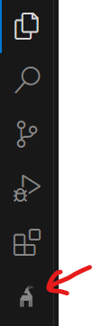

# GoatSwitch AI Chat VS Code Extension

GoatSwitch AI is a transformative tool for modernizing codebases using AI, simplifying complex upgrades for developers. This extension provides an interactive, chat-based experience for modernizing .NET and Java projects, with real-time Git diffs and safe execution.

A nicer version of the documentation is available at [GoatSwitch AI Chat Docs](https://docs.goatswitch.ai).

---

## Key Features

- **AI-Powered Analysis**: Scans codebases to suggest modernization opportunities.
- **Interactive Modernization**: Chat interface to specify and refine tasks.
- **Live Updates**: Real-time Git diff view for tracking changes.
- **Safe Execution**: Git-tracked modifications for easy review and rollback.

---

## Requirements

### .NET Projects

- Git repository
- .csproj file
- Up to 10,000 LoC (free version)

### Java Projects

- Git repository
- pom.xml or build.gradle
- Up to 10,000 LoC (free version)

---

## Installation

1. Search "GoatSwitch AI Chat" in the VSCode Extensions Marketplace and click "Install."
2. Verify the GoatSwitch icon appears in the activity bar.

---

## Usage

1. **Open Folder**: Ensure there are no pending changes in the Git repository.
2. **Select Project**: Click the GoatSwitch icon in VSCode to begin.
3. **Describe Task**: Specify tasks such as "Upgrade to .NET 8" or "Refactor legacy code patterns" and press "Enter".
4. **Review AI Plan**: After generating a task plan, you can:
   - **Approve**: Confirm the AI plan, and watch real-time changes in the Git diff view.
   - **Decline and Revise**: Adjust the task description if the AI's plan doesn’t meet your needs and press "Enter".
5. **Review Changes**: After all steps are done, review the changes in the Git extension, commit or discard them and start a new task.

---

## Common Tasks

### .NET

- Upgrade to .NET 8
- Refactor legacy patterns
- Remove deprecated APIs
- Switch to Entity Framework Core

### Java

- Update to Java 21
- Refactor legacy patterns
- Remove deprecated APIs
- Switch to Hibernate

---

## Troubleshooting

### Project Detection Issues

- Ensure project size < 10,000 LoC.
- Check for .csproj/pom.xml/build.gradle file.
- Verify repository is initialized and clean.

### Runtime Issues

- Reload VSCode window or restart VSCode if chat becomes unresponsive.
- If AI generates unexpected changes, use the VSCode Git extension to review and revert modifications.

### Platform Limitations

- Works on Windows, macOS, and Linux.
- Unsupported on VSCode Web.

---

## Support

For bugs or feature requests, visit [GitHub Issues](https://github.com/GoatSwitch/web-docs).  
Email support available at hello@goatswitch.ai.

## Acknowledgments

This extension includes code from [Cline Bot Inc.](https://github.com/cline/cline), licensed under the Apache License, Version 2.0. A copy of the license is available in the NOTICE file.
