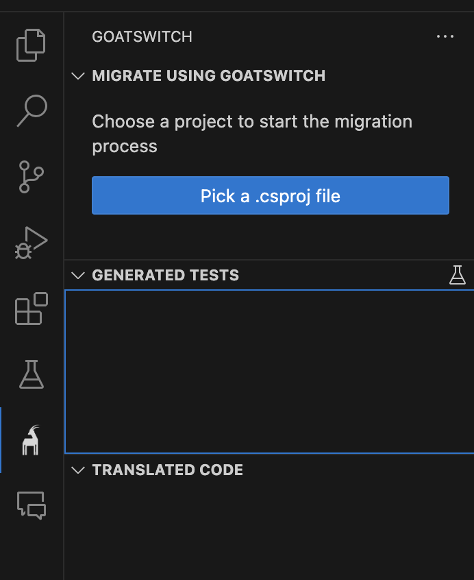
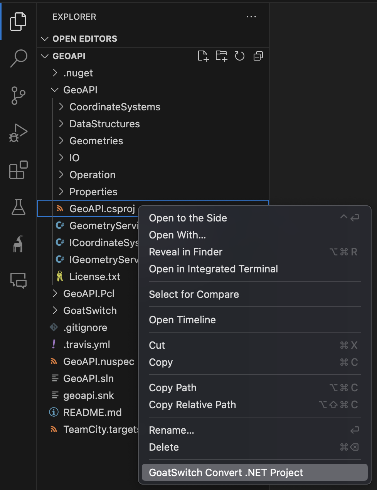

# GoatSwitch AI

VSCode Extension for GoatSwitch AI

## Features

At the moment the extension supports the following language pairs:

- .Net Framework -> .Net 8
- MS Access forms -> Angular

## Installation

GoatSwitchVSC can be installed using the Visual Studio Code Extension Marketplace.

After installation you should see the GoatSwitch logo in your VSCode activity bar in the left.

Finally you are prompted to log into your microsoft account, once you did that you can start using goatswitch.
NOTE: Make sure to use the microsoft account you used to buy GoatSwitch AI.

## Usage

### Starting the migration workflow
GoatSwitch can convert .Net projects defined by a .csproj file. If you want to migrate a .Net Framework project, there are two way to start the process.
1. Using the GoatSwitch view in the activity bar on the left. Click the "Pick a .csproj file"-button to start the migration workflow.

2. Right clicking a .csproj in the file epxlorer. Right click and select "GoatSwitch convert .Net project" to start.

### Fixing failed tests
Coming Soon!
### Fixing failed translations
Coming Soon!

## FAQ
- I cannot sign into my microsoft account (AADSTS700016)
  - This happens when using WSL with VSCode. Trying again without connection vscode to wsl should fix the issue
- How to reach you?
  - Email us anytime at hello@goatswitch.ai

